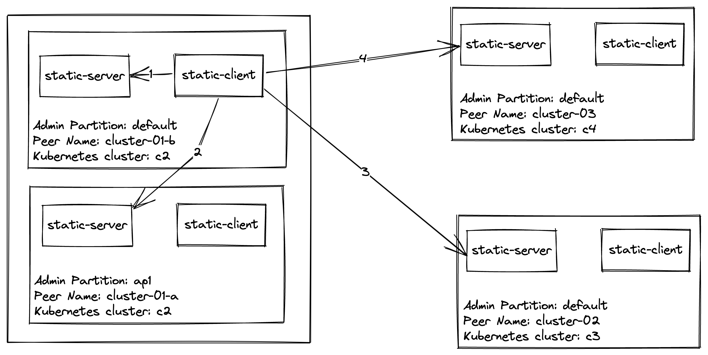

# Consul Sameness Test Setup

## Architecture



## Setup Steps

1. Make sure all variables are set correct in the `makefile`
2. Install K3d
3. `make setup` - This creates the k3d registry, builds/pushes the Consul/Consul-K8s images and sets up the value-*.yaml files
4. `make install`
   - Deletes and creates four k3d Kubernetes clusters.
   - Installs Consul on each of the four Kubernetes created in the previous step.
   - Runs the static-client and static-server services on each Kubernetes cluster. static-server returns the peer name for the given partition.
   - Synchronizes configuration entries to each member of the sameness group.

## Common Issues
1. If the image is having issues pushing to the K3d registry, make sure that registry is added to your host file `/etc/host`
   example content. 
   ```shell
   127.0.0.1 k3d-registry.localhost
   ```

## Testing

After runing the setup steps, the following tests making requests from `static-client` in `cluster-01-a` `static-server`.
`static-server` is configured to failover to sameness group members in the following order: `cluster-01-a`, `cluster-01-b`, `cluster-02` and finally `cluster-03`.

Run the following commands to verify this:
1. `./make_request.sh` - Returns `cluster-01-a`
2. `./scale.sh 1 0` to trigger a failover.
3. `./make_request.sh` - Returns `cluster-01-b`
4. `./scale.sh 2 0` to trigger a failover.
5. `./make_request.sh` - Returns `cluster-03`
6. `./scale.sh 4 0` to trigger a failover.
7. `./make_request.sh` - Returns `cluster-02`
