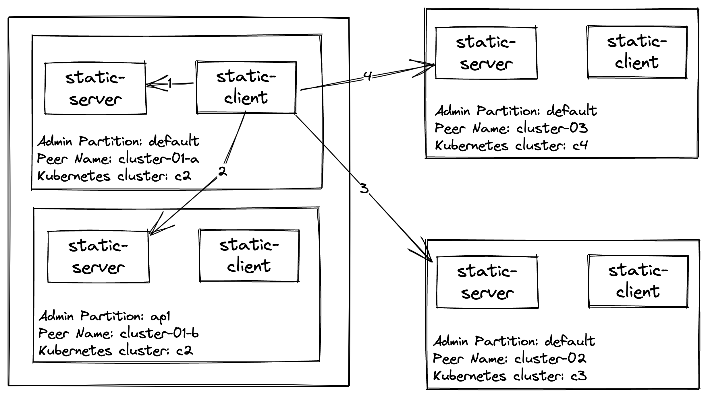

# Consul Sameness Test Setup

## Architecture



## Setup Steps

1. `./reset-clusters.sh` - This deletes and creates four `k3d` Kubernetes clusters.
2. `./install-consul.sh` - This installs Consul on each of the four Kubernetes created in the previous step.
3. `./configure_k8s.sh` - Runs the `static-client` and `static-server` services on each Kubernetes cluster. `static-server` returns the peer name for the given partition.
3. `./port-forward-c1-server.sh`
4. `./port-forward-c3-server.sh`
5. `./port-forward-c4-server.sh`
5. `./sameness-sync.sh` - Syncronizes configuration entires to each member of the sameness group. This uses a terrible POC sameness manager.

## Sameness Syncer

The POC `consul-sameness-manager` takes a configuration file and a folder of Consul configuration entries. 
The configuration file looks like the following:

```json
{
  "name": "mine",
  "default_for_failover": false,
  "datacenters": [
    {"name": "dc1", "url": "https://localhost:8501", "ACLToken": "..."},
    {"name": "dc2", "url": "https://localhost:8502", "ACLToken": "..."},
    {"name": "dc3", "url": "https://localhost:8503", "ACLToken": "..."}
  ],
  "members": [
    {"datacenter": "dc1", "partition": "default", "peer": "cluster-01-a"},
    {"datacenter": "dc1", "partition": "ap1", "peer": "cluster-01-b"},
    {"datacenter": "dc2", "partition": "default", "peer": "cluster-02-a"},
    {"datacenter": "dc3", "partition": "default", "peer": "cluster-03-a"}
  ]
}
```

Based on this configuration file, it automatically stores configuration entries 
to each partition and configures cluster peering for between remote partitions.

## Testing

After runing the setup steps, the following tests making requests from `static-client` in `cluster-01-a` `static-server`.
`static-server` is configured to failover to sameness group members in the following order: `cluster-01-a`, `cluster-01-b`, `cluster-02` and finally `cluster-03`.

Run the following commands to verify this:
1. `kubectl exec -it --context k3d-c1 deploy/static-client -- curl localhost:8080` - Returns `cluster-01-a`
2. `kubectl scale --context k3d-c1 --replicas=0 deploy/static-server` to trigger a failover.
3. `kubectl exec -it --context k3d-c1 deploy/static-client -- curl localhost:8080` - Returns `cluster-01-b`
4. `kubectl scale --context k3d-c2 --replicas=0 deploy/static-server` to trigger a failover.
3. `kubectl exec -it --context k3d-c1 deploy/static-client -- curl localhost:8080` - Returns `cluster-02`
4. `kubectl scale --context k3d-c3 --replicas=0 deploy/static-server` to trigger a failover.
3. `kubectl exec -it --context k3d-c1 deploy/static-client -- curl localhost:8080` - Returns `cluster-03`

